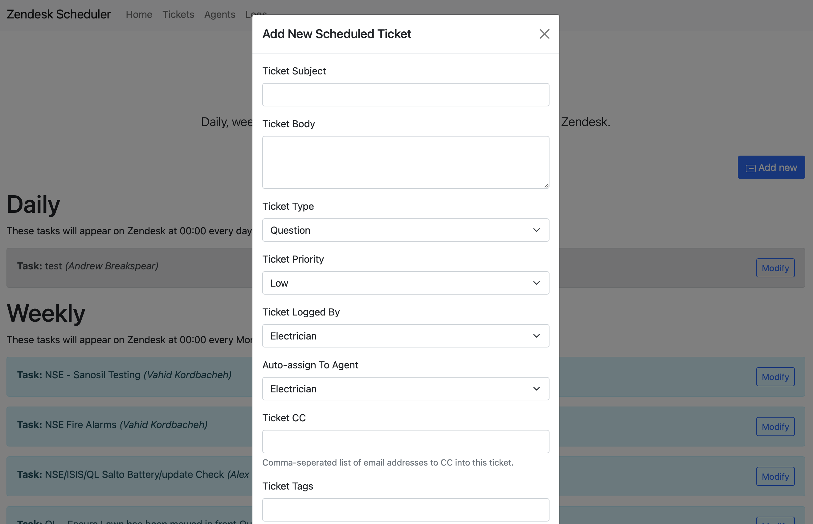

# Zammad Scheduler

Zammad Scheduler is a small PHP app that helps you create, manage, and schedule tickets for your Zammad help desk without having to remember every recurring ticket yourself.

It logs users in through LDAP, pulls groups and users from Zammad, lets you build scheduled ticket templates, creates tickets on a daily, weekly, monthly, or yearly cadence, and keeps a log of what happened.

The app is a web-based scheduler for Zammad tickets. You define a ticket once, choose who it should be assigned to, which group it belongs in, the priority, tags, CCs, and how often it should appear. Then the cron scripts do the boring part and create the ticket in Zammad at the right time.

From the UI you can:

- sign in with LDAP
- view scheduled tickets by Zammad group
- create new scheduled tickets
- edit existing schedules
- disable or delete local schedules
- trigger a ticket immediately with `Run Now`
- inspect logs for logins, updates, and cron activity

## Requirements

- PHP
- Composer
- PostgreSQL
- A Zammad instance
- A Zammad API token
- LDAP access for authentication
- Cron access on the server that will run the scheduled jobs

The app uses these Composer packages:

- `directorytree/ldaprecord`
- `zammad/zammad-api-client-php`

## Installation

1. Clone the repository to your web server.
2. Install dependencies:

   ```bash
   composer install
   ```

3. Create your runtime config:

   ```bash
   cp inc/config.phpSAMPLE inc/config.php
   ```

4. Edit `inc/config.php` and set:

   - database host, name, username, and password
   - Zammad URL and API token
   - LDAP host, bind DN, bind password, and base DN
   - any optional settings such as log retention

5. Create the database tables.
   - Open `install.php` in your browser and run the installer, or
   - import `mysql_import.sql` into your PostgreSQL database manually

6. Make sure your web server document root points at the app directory.
7. Update the hardcoded document root path in `cron/run.php` so it matches your deployment.
8. Add one cron job for the scheduler.

## Cron setup

The repository includes a single scheduler entrypoint:

- `cron/run.php`

Run that script once per day. It will automatically create any tickets due that day across the daily, weekly, monthly, and yearly schedules. For example:

```bash
0 2 * * * /usr/bin/php /path/to/zammad_scheduler/cron/run.php
```

## Usage

Once installed, open the app in your browser and log in with your LDAP credentials. From there you can:

1. Create a scheduled ticket.
2. Pick the Zammad group, priority, assignee, customer, tags, and CCs.
3. Choose a frequency:
   - Daily
   - Weekly
   - Monthly
   - Yearly
4. If you pick yearly, specify one or more dates in the picker.
5. Save the schedule and let cron do the rest.

When the job runs, the app creates a new ticket in Zammad with the saved settings and stores the created Zammad ticket ID locally.

## Notes

- The local database stores the scheduler records and logs, not the Zammad tickets themselves.
- `Run Now` is handy when you want to test a schedule or launch one immediately.
- The yearly picker stores dates in `MON-01` style values.
- If you are debugging, set `debug` to `true` in `inc/config.php`.

## Screenshot



## License

See [LICENSE](LICENSE).
